<p align="center">
  
</p>

<p align="center">
  <a href="https://beernelli.in/">Portfolio</a> &nbsp; / &nbsp;
  <a href="https://www.linkedin.com/in/vishnu-vardhan">LinkedIn</a> &nbsp; / &nbsp;
  <a href="https://www.deeztop.com/">Deeztop</a>
</p>

### Hey, I'm Vishnu.

I'm a **Computer Science & Information Technology undergraduate at MVSR Engineering College**, graduating in **2027**. I build full-stack applications and explore applied machine learning—from real-time systems to computer vision and causal inference.

I like projects where the model, API and interface work together—not just in a notebook.

```js
const vishnu = {
  basedIn: "Hyderabad, India",
  graduating: 2027,
  focus: ["Full-stack systems", "Applied AI", "Real-time applications"],
  approach: "Build it. Understand it. Improve it."
};
```

### Selected builds

| Project | What I built | Main tools |
| :--- | :--- | :--- |
| [OTT Retention Intelligence](https://github.com/VISHNU4718/ott-causal-llm) | A self-attentive transformer and causal uplift models for estimating the effects of retention interventions. | PyTorch · Transformers · scikit-learn |
| [FaceMatcher](https://github.com/VISHNU4718/FaceMatcher) | A team-built face-recognition system with media matching, a live WebSocket pipeline and an interactive results dashboard. | FastAPI · React · OpenCV · DeepFace |
| [UniShare](https://github.com/VISHNU4718/Unishare) | File sharing with WebRTC transfers, QR-based sharing, encrypted storage and live chat. | React · FastAPI · MongoDB · Docker |
| [SmartRoute](https://github.com/VISHNU4718/SmartRoute) | Real-time delivery tracking, route batching and a QR handoff workflow. | FastAPI · React · Socket.IO · Leaflet |
| [Deeztop](https://github.com/VISHNU4718/deeztop) | A live desk-setup discovery website with curated product collections and guides. | HTML · CSS · JavaScript |

### My toolkit


- **Backend:** Node.js, Express, FastAPI, REST APIs, WebSockets, JWT authentication
- **Frontend:** React, Next.js, HTML, CSS, Tailwind CSS
- **Data & AI:** OpenCV, DeepFace, TensorFlow, PyTorch, Transformers, Pandas, scikit-learn
- **Storage & deployment:** MongoDB, MySQL, SQLite, Docker, AWS, Vercel
- **Foundations:** Data structures & algorithms, OOP, DBMS, operating systems, computer networks

### Contribution flow

<picture>
  <source media="(prefers-color-scheme: dark)" srcset="./assets/contribution-snake-dark.svg?v=dates" />
  <source media="(prefers-color-scheme: light)" srcset="./assets/contribution-snake.svg?v=dates" />
  
</picture>

<sub>My GitHub contribution activity, reimagined as a teal snake. Refresh scheduled every six hours; public contribution activity only.</sub>

### Beyond the build

Training includes the **Palo Alto Cyber Security Virtual Internship through EduSkills**, **HP Foundation Data Science & Analytics**, and **Hugging Face's LLM course fundamentals**.

Interested in software engineering and applied AI opportunities. Explore my projects or connect through [LinkedIn](https://www.linkedin.com/in/vishnu-vardhan).

---

<p align="center"><sub>Useful software. Thoughtful interfaces. Always learning.</sub></p>
